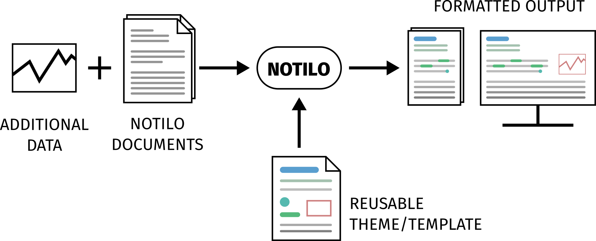

# Notilo

An extensible structured document formatting system &mdash; in progress.

## Project overview

The goal of this project is to create a system &mdash; a markup language being the logical choice &mdash; to format structured documents in a semantic way.

The following picture illustrates the main idea:

- **Additional data**: images, source code, data tables ...

- **Notilo documents**: text-based documents, annotated using the Notilo system.

- **Reusable theme/template**: a document containing the formatting details; it can also describe additional domain-based 'elements', including their structure and formatting. It is a reusable theme/template that can be applied to every notilo document, but will generaly be customized for a specific domain &mdash; i.e. containing structures and elements often used in (and sometimes exclusive to) this domain.

- **NOTILO**: the notilo 'engine', a tool used to convert all inputs to a nicely formatted output.

- **Formatted output**: the output produced by NOTILO, which can be in many formats, such as PDF for print and HTML for web.

### Goals

The primary goal and first part of the project is writing a detailed specification of the Notilo system. This includes, first of all, a description of what the system *is* (e.g. markup language) and *how* it should work. Secondly, it contains an unambiguous spec of the syntax and semantics of the system. This will form the Notilo system, as well as the project's foundation.

To make it practical and useful, there is need for a Notilo 'engine'. This is the second part of the project, where a minimal reference implementation of the Notilo system will be made. It will cover the required, unextensible part of Notilo. Later on, a more thorough implementation, covering all Notilo features, can be made.

### Planning and current state

The project is, of course, a long-term project. Because the author is currently quite busy, commits will be of low-frequency. In the beginning, most of the work will be done privately, so any public commits (in this period) will be rare. Afterwards, when the main idea and first draft are present, the project will speed up and become completely public. An estimated date for this first 'milestone', will be added here as soon as an accurate prediction is possible.
